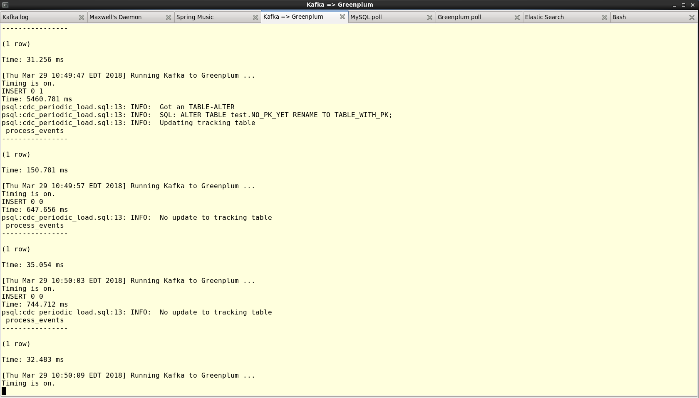

# Change Data Capture (CDC) from MySQL to Greenplum Database

## Abstract
When a Pivotal Cloud Foundry operator installs PCF, it’s very likely they will
choose to deploy the MySQL database tile (the author's observation).
With this in place, developers can easily self-provision a persistence layer
for their applications.  Each of these MySQL database instances tends to serve
a single application so, with multiple apps running, you end up with multiple
databases.  These are optimized for transactional workloads, but
not complex, analytical queries or very large data sets.  This is where
[Greenplum Database](https://greenplum.org) can be brought in, to complement those
MySQL databases by providing that long-term, deep analytical platform.

## Approach
* [Maxwell's Daemon](http://maxwells-daemon.io/) captures any DDL or DML operations in MySQL and publishes them to a RabbitMQ exchange, in a JSON format.
* RabbitMQ provides the messaging layer.
* Greenplum Database external tables uses [this RabbitMQ client](./rabbitmq.go) to ingest these MySQL events.
* Periodically (see `./cdc_periodic_load.sql`):
  - A Greenplum query polls RabbitMQ, inserting new events into the `maxwell_event` table
  - Another Greenplum query runs the `process_events` PL/PGSQL function, which maintains the replicas of the MySQL objects

## Running the demo (single VM with Greenplum 5.x installed and running)

* Install RabbitMQ and start it up (varies by operating system; Homebrew works on a Mac)
* Install MySQL server, configure it per the "Row based replication" section in the [Maxwell's Daemon quick start](http://maxwells-daemon.io/quickstart/), and start it up.
* Run the `GRANT` commands shown in the "Mysql permissions" section of that Maxwell's Daemon quick start.
* Download and extract Maxwell's Daemon:
  ```
  $ curl -sLo - https://github.com/zendesk/maxwell/releases/download/v1.20.0/maxwell-1.20.0.tar.gz | tar zxvf -
  ```
* Start Maxwell's Daemon (See "Maxwell's Daemon" tab in the picture):
  ```
  $ ./maxwell-1.20.0/bin/maxwell --output_ddl=true --user='maxwell' --password='maxwell' --producer=rabbitmq --rabbitmq_host='127.0.0.1' --rabbitmq_routing_key_template="mysql-cdc" --rabbitmq_exchange_durable=true
  ```
* Create the MySQL database "music", along with a user, for the [Spring Music app](https://github.com/cloudfoundry-samples/spring-music):
  ```
  mysql> CREATE DATABASE MUSIC;
  mysql> GRANT ALL ON music.* TO 'music'@'localhost' IDENTIFIED BY 'music';
  ```
* Simulate a Cloud Foundry app's environment, with a binding to a MySQL instance:
  ```
  $ export VCAP_APPLICATION=$( cat ./VCAP_APPLICATION.json )
  $ export VCAP_SERVICES=$( cat ./VCAP_SERVICES_MYSQL.json )
  ```
* Get a local copy of the Spring music app:
  ```
  $ git clone https://github.com/cloudfoundry-samples/spring-music.git
  ```
* Build the app per its instructions
* Start the Spring Music app (from within the `spring-music` directory -- see "Spring Music" tab in the picture):
  ```
  $ java -jar ./build/libs/spring-music.jar
  ```
* While logged in as `gpadmin`, run the following to set up the tables and functions to handle CDC:
  ```
  $ createdb maxwell
  $ psql maxwell -f ./maxwell_gpdb.sql # Alter the 'PARTITION BY RANGE' endpoints as necessary
  $ createlang plpythonu maxwell
  $ psql maxwell -f ./cdc_plpgsql_functions.sql
  ```
* Start the periodic load into Greenplum:
  ```
  while true
  do
    echo "[`date`] Running RabbitMQ to Greenplum ..."
    psql maxwell -f ./cdc_periodic_load.sql
    echo
    sleep 5
  done
  ```
* Poll the MySQL DB (See "MySQL poll" tab in the picture):
  ```
  while true
  do
    echo "[`date`] Polling the music.album table in MySQL ..."
    echo "SELECT * FROM music.album ORDER BY artist, title;" | mysql --table -u music music
    echo
    sleep 5
  done
  ```
* Poll Greenplum (See the "Greenplum poll" tab in the picture):
  ```
  while true
  do
    echo "[`date`] Polling the music.album table in Greenplum ..."
    echo "SELECT * FROM music.album ORDER BY artist, title;" | psql maxwell
    echo
    sleep 5
  done
  ```
* Access the [Spring Music UI](http://localhost:8080/) and make some changes to the data, then you should
be able to see those changes occur in the Greenplum table via the "Greenplum poll" tab.
* If you log into MySQL as "root", then run `CREATE DATABASE some_db_name`, you should be able to observe
this event in the "RabbitMQ => Greenplum" tab.  Here are some other DDL operations to try:
  - `CREATE TABLE`
  - `ALTER TABLE`
  - `DROP TABLE`
  - `DROP DATABASE`

## Deploying Maxwell's Daemon in Cloud Foundry
1. Create an instance of the MySQL service (NOTE: this won't work yet since it requires the escalated privileges to perform the required `GRANT` operations).
1. [Accessing service instance via SSH](https://docs.pivotal.io/pivotalcf/2-3/devguide/deploy-apps/ssh-services.html)
1. Create an instance of a RabbitMQ service.
1. Copy `./manifest.yml` and `./run_maxwell.py` into the root of the Maxwell's Daemon project you downloaded.
1. From within that directory: `cf push --no-start`
1. Bind those two service intances to the app; e.g. `cf bs maxwell mysql && cf bs maxwell rabbit`
1. Start Maxwell's Daemon: `cf start maxwell`

## TODO
1. Add some scripts to handle periodic Greenplum maintenance
   * [Vacuum tables and catalog](https://gpdb.docs.pivotal.io/43170/admin_guide/managing/maintain.html)
2. Add another consumer group to "fan out" fan out to Elastic Search
   * Try just using a single index for all tables
   * Form the `doc_id` using the primary key values from the table?
   * Also index/store the DB name and the table name
3. Consider how an "undo" would work, since we can reverse any action.
4. Enhance demo to include data from a µ-services architecture, like [this one](https://spring.io/blog/2015/07/14/microservices-with-spring)

## See also
* [Canal](https://github.com/siddontang/go-mysql#canal), a Go lang binlog replicator

## Known issues

### After the VM running the whole demo crashed, I encountered this state upon restarting Maxwell's Daemon:
```
10:30:07,078 INFO  BinlogConnectorLifecycleListener - Binlog connected.
10:30:07,129 WARN  BinlogConnectorLifecycleListener - Event deserialization failure.
com.github.shyiko.mysql.binlog.event.deserialization.EventDataDeserializationException: Failed to deserialize data of EventHeaderV4{timestamp=1522558072000, eventType=UPDATE_ROWS, serverId=1, headerLength=19, dataLength=89, nextPosition=48082965, flags=0}
	at com.github.shyiko.mysql.binlog.event.deserialization.EventDeserializer.deserializeEventData(EventDeserializer.java:216) ~[mysql-binlog-connector-java-0.13.0.jar:0.13.0]
	at com.github.shyiko.mysql.binlog.event.deserialization.EventDeserializer.nextEvent(EventDeserializer.java:184) ~[mysql-binlog-connector-java-0.13.0.jar:0.13.0]
	at com.github.shyiko.mysql.binlog.BinaryLogClient.listenForEventPackets(BinaryLogClient.java:890) [mysql-binlog-connector-java-0.13.0.jar:0.13.0]
	at com.github.shyiko.mysql.binlog.BinaryLogClient.connect(BinaryLogClient.java:559) [mysql-binlog-connector-java-0.13.0.jar:0.13.0]
	at com.github.shyiko.mysql.binlog.BinaryLogClient$7.run(BinaryLogClient.java:793) [mysql-binlog-connector-java-0.13.0.jar:0.13.0]
	at java.lang.Thread.run(Thread.java:748) [?:1.8.0_161]
Caused by: com.github.shyiko.mysql.binlog.event.deserialization.MissingTableMapEventException: No TableMapEventData has been found for table id:1116691496960. Usually that means that you have started reading binary log 'within the logical event group' (e.g. from WRITE_ROWS and not proceeding TABLE_MAP
	at com.github.shyiko.mysql.binlog.event.deserialization.AbstractRowsEventDataDeserializer.deserializeRow(AbstractRowsEventDataDeserializer.java:98) ~[mysql-binlog-connector-java-0.13.0.jar:0.13.0]
	at com.github.shyiko.mysql.binlog.event.deserialization.UpdateRowsEventDataDeserializer.deserializeRows(UpdateRowsEventDataDeserializer.java:71) ~[mysql-binlog-connector-java-0.13.0.jar:0.13.0]
	at com.github.shyiko.mysql.binlog.event.deserialization.UpdateRowsEventDataDeserializer.deserialize(UpdateRowsEventDataDeserializer.java:58) ~[mysql-binlog-connector-java-0.13.0.jar:0.13.0]
	at com.github.shyiko.mysql.binlog.event.deserialization.UpdateRowsEventDataDeserializer.deserialize(UpdateRowsEventDataDeserializer.java:33) ~[mysql-binlog-connector-java-0.13.0.jar:0.13.0]
	at com.github.shyiko.mysql.binlog.event.deserialization.EventDeserializer.deserializeEventData(EventDeserializer.java:210) ~[mysql-binlog-connector-java-0.13.0.jar:0.13.0]
	... 5 more
```
**This was the resolution, for the demo:**
1. Stop Maxwell's Daemon
1. Run the following from the MySQL command prompt, logged in as the DB super-user:
    ```
    mysql> PURGE BINARY LOGS BEFORE '2018-04-02 10:36:33';
    mysql> DROP DATABASE maxwell;
    ```
1. Restart Maxwell's Daemon
