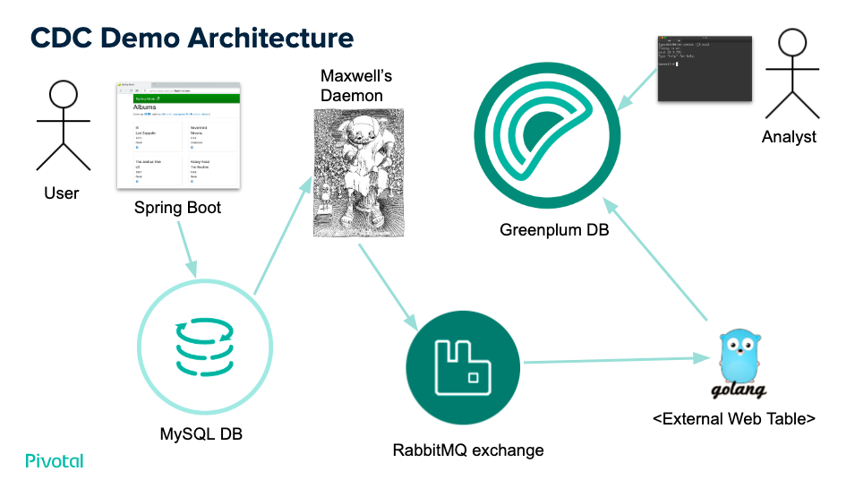
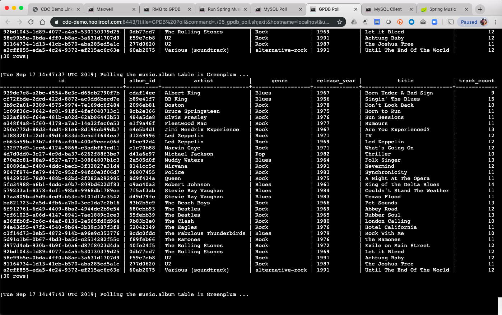

# [Demo](./demo/cdc_demo_script.md#cdc-demo-script) of Change Data Capture (CDC) from MySQL to Greenplum



[Video walk-through of this demo](https://youtu.be/U6jmdhkPEO0)

## Abstract
When a Pivotal Cloud Foundry operator installs PCF, it’s likely they will
choose to deploy the MySQL database tile (the author's observation).
With this in place, developers can easily self-provision a persistence layer
for their applications.  Each of these MySQL database instances tends to serve
a single application so, with multiple apps running, you end up with multiple
databases.  These are optimized for transactional workloads, but
not complex, analytical queries or very large data sets.  This is where
[Greenplum Database](https://greenplum.org) can be brought in, to complement those
MySQL databases by providing that long-term, deep analytical platform.

## Approach
* [Maxwell's Daemon](http://maxwells-daemon.io/) captures any DDL or DML operations in MySQL and publishes them to a RabbitMQ exchange, in a JSON format.
* RabbitMQ provides the messaging layer.
* Greenplum Database external tables uses [this RabbitMQ client](./rabbitmq.go) to ingest these MySQL events.
* Periodically (see `./cdc_periodic_load.sql`):
  - A Greenplum query polls RabbitMQ, inserting new events into the `maxwell_event` table
  - A separate Greenplum query runs the maintains replicas of the MySQL objects

## Setting up the demo on a single virtual machine (VM)


**NOTE:** If the demo has already been configured, skip to [this link](./demo/cdc_demo_script.md)

* Deploy a Linux based VM (here, we are using a t2.xlarge VM, running Ubuntu 18.04, on EC2).
* The demo is run via several terminals running via
  [WebSSH](https://github.com/huashengdun/webssh), which must be installed and
  [started using SSL](./demo/00_start_webssh.sh), with a [firewall rule](images/ec2_firewall_settings.png) set
  up to permit traffic to this port of the VM, but only from a specific IP
  address (or a range, depending on your preference).  Here are the steps to run within
  the VM:
  ```
  $ sudo apt install python-pip
  $ pip install webssh
  $ ~/.local/bin/wssh --sslport=8443 --certfile='./your_ssl_cert.crt' --keyfile='./your_ssl_cert.key'
  ```
* The WebSSH approach uses SSH to connect to `localhost` using a password, adding a couple of steps.
  1. Enable SSH via password, for `localhost` only by editing `/etc/ssh/sshd_config`, adding this:
     ```
     # Settings that override the global settings for matching IP addresses only
     Match address 127.0.0.1/32
         PasswordAuthentication yes
     ```
  1. Restart the SSH daemon: `sudo service sshd restart`
  1. Assign a password for user `ubuntu`: `sudo passwd ubuntu`.  We'll refer to this later as `NEW_PASSWORD`.
* Install and initialize Greenplum Database: [OSS](https://greenplum.org/download/),
  [Pivotal supported](https://network.pivotal.io/products/pivotal-gpdb/), or even an
  [easy button](https://aws.amazon.com/marketplace/pp/B06XKQ8Z3H) cloud version.
* Install RabbitMQ and start it up (varies by operating system).
* Install MySQL server.
* Follow the procedure in [Maxwell's Daemon quick start](http://maxwells-daemon.io/quickstart/)
* Start Maxwell's Daemon (by default, it uses the "guest" account in RabbitMQ):
  ```
  $ ./maxwell-1.*/bin/maxwell --output_ddl=true --user='maxwell' --password='maxwell' --producer=rabbitmq --rabbitmq_host='127.0.0.1' --rabbitmq_routing_key_template="mysql-cdc" --rabbitmq_exchange_durable=true
  ```
* Install Go and create your gopath directory (here, we install onto Ubuntu):
  ```
  $ sudo apt-get install golang-go
  $ mkdir ~/go
  ```
* Build and install the RabbitMQ client (it's in this GitHub repo):
  ```
  $ git clone https://github.com/mgoddard-pivotal/greenplum-cdc.git
  $ cd greenplum-cdc/
  $ git checkout rabbitmq
  $ go get github.com/streadway/amqp
  $ go build rabbitmq.go
  $ sudo cp -f rabbitmq ~gpadmin/
  ```
* While logged in as `gpadmin`, run the following to set up the tables and functions to handle CDC:
  ```
  $ createdb maxwell
  $ psql maxwell -f ./maxwell_gpdb.sql # Alter the 'PARTITION BY RANGE' endpoints as necessary
  $ createlang plpythonu maxwell
  $ psql maxwell -f ./cdc_plpgsql_functions.sql
  ```
* In a terminal, start the periodic load into Greenplum:
  ```
  while true
  do
    echo "[`date`] Running RabbitMQ to Greenplum ..."
    psql maxwell -f ./cdc_periodic_load.sql
    echo
    sleep 5
  done
  ```
* (As root) Create the MySQL database "music", along with a user, for the [Spring Music app](https://github.com/cloudfoundry-samples/spring-music):
  ```
  mysql> CREATE DATABASE music;
  mysql> CREATE USER 'music'@'localhost' IDENTIFIED BY 'music';
  mysql> GRANT ALL ON music.* TO 'music'@'localhost' IDENTIFIED BY 'music';
  ```
* Simulate a Cloud Foundry app's environment, with a binding to a MySQL instance:
  ```
  $ export VCAP_APPLICATION=$( cat ./VCAP_APPLICATION.json )
  $ export VCAP_SERVICES=$( cat ./VCAP_SERVICES.json )
  ```
* Get a local copy of the Spring music app:
  ```
  $ git clone https://github.com/cloudfoundry-samples/spring-music.git
  ```
* Build the app per its instructions
  ```
  $ cd spring-music/ ; ./gradlew clean build
  ```
* Start the Spring Music app (from within the `spring-music` directory -- see "Spring Music" tab in the picture):
  ```
  $ java -jar ./build/libs/spring-music-1.0.jar
  ```
* (Optional) In a different terminal/tab, poll the MySQL DB (See "MySQL poll" tab in the picture):
  ```
  while true
  do
    echo "[`date`] Polling the music.album table in MySQL ..."
    echo "SELECT * FROM music.album ORDER BY artist, title;" | mysql --table -u music music --password=music 2>/dev/null
    echo
    sleep 5
  done
  ```
* In another terminal/tab, poll Greenplum (See the "Greenplum poll" tab in the picture):
  ```
  while true
  do
    echo "[`date`] Polling the music.album table in Greenplum ..."
    echo "SELECT * FROM music.album ORDER BY artist, title;" | psql maxwell
    echo
    sleep 5
  done
  ```
* Access the [Spring Music UI](http://localhost:8080/) and make some changes to the data, then you should
be able to see those changes occur in the Greenplum table via the "Greenplum poll" tab.
* If you log into MySQL as "root", then run `CREATE DATABASE some_db_name`, you should be able to observe
this event in the "RabbitMQ => Greenplum" tab.  Here are some other DDL operations to try:
  - `CREATE TABLE`
  - `ALTER TABLE`: `ALTER TABLE album ADD COLUMN price DECIMAL(15, 2);`
  - `DROP TABLE`
  - `DROP DATABASE`

## (Future) Deploying Maxwell's Daemon in Cloud Foundry
1. Create an instance of the MySQL service (NOTE: this won't work yet since it requires the escalated privileges to perform the required `GRANT` operations).
1. [Accessing service instance via SSH](https://docs.pivotal.io/pivotalcf/2-3/devguide/deploy-apps/ssh-services.html)
1. Create an instance of a RabbitMQ service.
1. Copy `./manifest.yml` and `./run_maxwell.py` into the root of the Maxwell's Daemon project you downloaded.
1. From within that directory: `cf push --no-start`
1. Bind those two service intances to the app; e.g. `cf bs maxwell mysql && cf bs maxwell rabbit`
1. Start Maxwell's Daemon: `cf start maxwell`

## TODO
1. Duplicate this, but for Postgres.  [This](https://github.com/eulerto/wal2json) looks like a promising starting point.
1. Add another consumer group to "fan out" to Elastic Search.
1. Consider how an "undo" would work, since we can reverse any action.
1. Enhance the demo to include data from a µ-services architecture, like [this one](https://spring.io/blog/2015/07/14/microservices-with-spring).

## Known issue

### After the VM running the whole demo crashed, I encountered this state upon restarting Maxwell's Daemon:
```
10:30:07,078 INFO  BinlogConnectorLifecycleListener - Binlog connected.
10:30:07,129 WARN  BinlogConnectorLifecycleListener - Event deserialization failure.
com.github.shyiko.mysql.binlog.event.deserialization.EventDataDeserializationException: Failed to deserialize data of EventHeaderV4{timestamp=1522558072000, eventType=UPDATE_ROWS, serverId=1, headerLength=19, dataLength=89, nextPosition=48082965, flags=0}
	at com.github.shyiko.mysql.binlog.event.deserialization.EventDeserializer.deserializeEventData(EventDeserializer.java:216) ~[mysql-binlog-connector-java-0.13.0.jar:0.13.0]
	at com.github.shyiko.mysql.binlog.event.deserialization.EventDeserializer.nextEvent(EventDeserializer.java:184) ~[mysql-binlog-connector-java-0.13.0.jar:0.13.0]
	at com.github.shyiko.mysql.binlog.BinaryLogClient.listenForEventPackets(BinaryLogClient.java:890) [mysql-binlog-connector-java-0.13.0.jar:0.13.0]
	at com.github.shyiko.mysql.binlog.BinaryLogClient.connect(BinaryLogClient.java:559) [mysql-binlog-connector-java-0.13.0.jar:0.13.0]
	at com.github.shyiko.mysql.binlog.BinaryLogClient$7.run(BinaryLogClient.java:793) [mysql-binlog-connector-java-0.13.0.jar:0.13.0]
	at java.lang.Thread.run(Thread.java:748) [?:1.8.0_161]
Caused by: com.github.shyiko.mysql.binlog.event.deserialization.MissingTableMapEventException: No TableMapEventData has been found for table id:1116691496960. Usually that means that you have started reading binary log 'within the logical event group' (e.g. from WRITE_ROWS and not proceeding TABLE_MAP
	at com.github.shyiko.mysql.binlog.event.deserialization.AbstractRowsEventDataDeserializer.deserializeRow(AbstractRowsEventDataDeserializer.java:98) ~[mysql-binlog-connector-java-0.13.0.jar:0.13.0]
	at com.github.shyiko.mysql.binlog.event.deserialization.UpdateRowsEventDataDeserializer.deserializeRows(UpdateRowsEventDataDeserializer.java:71) ~[mysql-binlog-connector-java-0.13.0.jar:0.13.0]
	at com.github.shyiko.mysql.binlog.event.deserialization.UpdateRowsEventDataDeserializer.deserialize(UpdateRowsEventDataDeserializer.java:58) ~[mysql-binlog-connector-java-0.13.0.jar:0.13.0]
	at com.github.shyiko.mysql.binlog.event.deserialization.UpdateRowsEventDataDeserializer.deserialize(UpdateRowsEventDataDeserializer.java:33) ~[mysql-binlog-connector-java-0.13.0.jar:0.13.0]
	at com.github.shyiko.mysql.binlog.event.deserialization.EventDeserializer.deserializeEventData(EventDeserializer.java:210) ~[mysql-binlog-connector-java-0.13.0.jar:0.13.0]
	... 5 more
```
**This was the resolution, for the demo:**
1. Stop Maxwell's Daemon
1. Run the following from the MySQL command prompt, logged in as the DB super-user:
    ```
    mysql> PURGE BINARY LOGS BEFORE '2018-04-02 10:36:33';
    mysql> DROP DATABASE maxwell;
    ```
1. Restart Maxwell's Daemon

